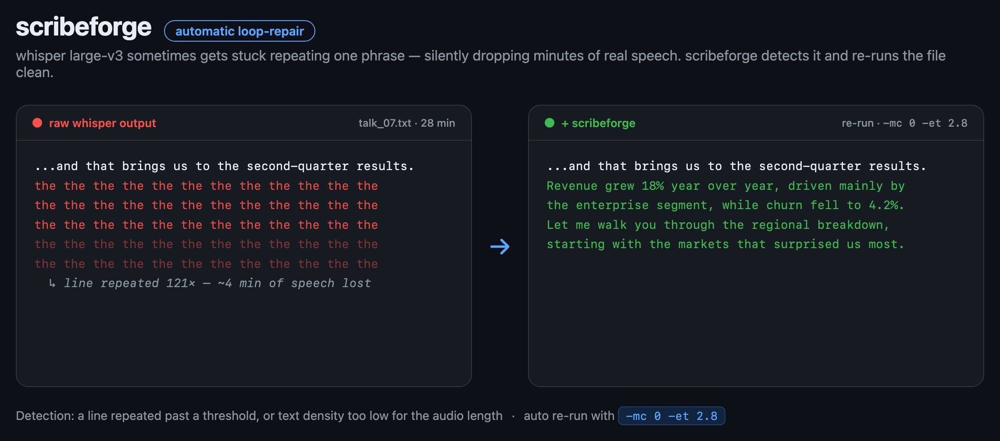

# scribeforge

**Turn talks and videos into clean, readable transcripts — and one polished PDF.**

`scribeforge` takes a list of video URLs (YouTube, RuTube, Vimeo, direct files —
anything [yt-dlp](https://github.com/yt-dlp/yt-dlp) supports), transcribes them
locally with [whisper.cpp](https://github.com/ggerganov/whisper.cpp), **repairs
whisper's repetition loops automatically**, polishes the text with an LLM, and
assembles everything into a single branded PDF (plus Markdown).

It was built to transcribe a 16-talk conference (4h+ of Russian audio) into one
hand-off-ready document. It works for any language whisper supports.



---

## Why another transcription tool?

Raw whisper output is rarely something you can hand to a human: no punctuation
that survives contact, filler words everywhere, mangled names — and one nasty
failure mode most pipelines ignore:

> **The whisper repetition loop.** On some files whisper large-v3 gets stuck
> repeating a single phrase dozens of times *instead of transcribing the real
> speech*, silently dropping minutes of content. On our conference it hit 8 of
> 16 files — once repeating a line **121 times** across a 30-minute talk.

`scribeforge` **detects this** (a line repeated past a threshold, or suspiciously
low text density for the duration) and **automatically re-runs** the offending
file with anti-loop decoder flags (`-mc 0 -et 2.8`) that break the self-feeding
context. Then it hands the clean text to an LLM for human-readable polishing.

| | raw whisper | + scribeforge |
|---|---|---|
| Repetition loops | silently drop content | detected & repaired |
| Punctuation / paragraphs | minimal | clean |
| Names & terms | mangled | corrected (you supply a roster) |
| Speaker turns | none | labelled |
| Output | one `.txt` per file | one Markdown + one PDF |

---

## Pipeline

```
sources.txt
   │  yt-dlp + ffmpeg
   ▼  (audio → 16 kHz mono WAV)
 fetch
   │  whisper.cpp (large-v3)
   ▼  + automatic loop detect & repair
 transcribe
   │  any OpenAI-compatible LLM
   ▼  (punctuation, names, speaker turns — facts untouched)
 polish
   │  HTML → headless Chrome
   ▼
 transcripts.pdf  +  transcripts.md
```

Every step is **resumable** — re-running skips work whose output already exists.

---

## Requirements

System tools (must be on `PATH`):

- **[yt-dlp](https://github.com/yt-dlp/yt-dlp)** and **ffmpeg** — audio download & conversion
- **[whisper.cpp](https://github.com/ggerganov/whisper.cpp)** — provides the `whisper-cli` binary
  - plus a ggml model, e.g. `ggml-large-v3.bin`
    ([download](https://huggingface.co/ggerganov/whisper.cpp))
- **Google Chrome / Chromium** — for PDF (optional; without it you still get Markdown)

```bash
# macOS (Homebrew)
brew install yt-dlp ffmpeg whisper-cpp
# model
curl -L -o ~/models/ggml-large-v3.bin \
  https://huggingface.co/ggerganov/whisper.cpp/resolve/main/ggml-large-v3.bin
```

Python package:

```bash
pip install scribeforge          # or: pip install -e . from a clone
```

---

## Quickstart

1. Write a sources file (`sources.txt`):

   ```
   # URL | Speaker (optional) | Title/track (optional)
   https://www.youtube.com/watch?v=XXXX | Jane Speaker | Opening keynote
   https://rutube.ru/video/<id>/        | John Doe     | Track 2
   ```

2. Point the polish step at an LLM (OpenAI by default):

   ```bash
   export OPENAI_API_KEY=sk-...
   ```

3. Run:

   ```bash
   scribeforge run sources.txt \
       --model ~/models/ggml-large-v3.bin \
       --lang en \
       --title "My Conference 2026" \
       --roster "Jane Speaker, John Doe" \
       --out out/
   ```

You get `out/transcripts.pdf`, `out/transcripts.md`, per-talk files under
`out/audio/`, and a `out/manifest.json`.

---

## Choosing the LLM

The polish step talks to **any OpenAI-compatible Chat Completions endpoint**:

```bash
# OpenAI (default)
export OPENAI_API_KEY=sk-...
scribeforge run sources.txt --llm-model gpt-4o-mini ...

# A local model via Ollama / LM Studio / vLLM
scribeforge run sources.txt \
    --base-url http://localhost:11434/v1 --llm-model llama3.1 ...

# No LLM at all — keep raw (loop-repaired) transcripts
scribeforge run sources.txt --no-polish ...
```

The polish prompt is conservative by design: **copy-edit only, never summarise,
keep every number and quote**. Override it with `--prompt your-prompt.md`
(see [`examples/prompt.example.md`](examples/prompt.example.md)).

---

## Options

```
scribeforge run SOURCES
  --out DIR             output directory (default: out/)
  --model PATH          whisper.cpp ggml model (e.g. ggml-large-v3.bin)
  --whisper NAME        whisper.cpp binary (default: whisper-cli)
  --lang CODE           language, e.g. ru / en (default: auto)
  --title TEXT          document + cover title
  --subtitle TEXT       cover kicker
  --roster "A, B, C"    correct speaker spellings (improves name fixing)
  --llm-model NAME      polish model (default: gpt-4o-mini)
  --base-url URL        OpenAI-compatible endpoint
  --prompt FILE         custom polish prompt
  --no-polish           skip LLM, keep raw transcripts
```

---

## Notes & limitations

- **Diarisation** is light: whisper doesn't separate speakers, so turn labels
  come from the LLM reading cues ("thanks, over to you…"). Give it a `--roster`
  for best results.
- **Cost**: transcription is local and free; only the (short, text-only) polish
  calls hit the LLM.
- **Speed**: whisper large-v3 on Apple Silicon (Metal) runs ~5× realtime, so
  ~4 hours of audio ≈ 45 min of transcription.

## Roadmap

- [ ] Timestamps / chapter markers option
- [ ] VAD pre-pass to cut silence before ASR
- [ ] Per-talk separate exports
- [ ] `faster-whisper` backend option

## License

MIT — see [LICENSE](LICENSE). Contributions welcome.
